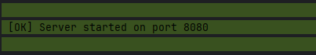
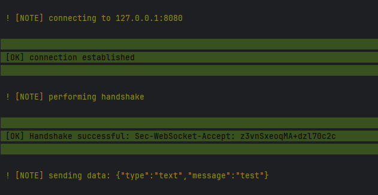
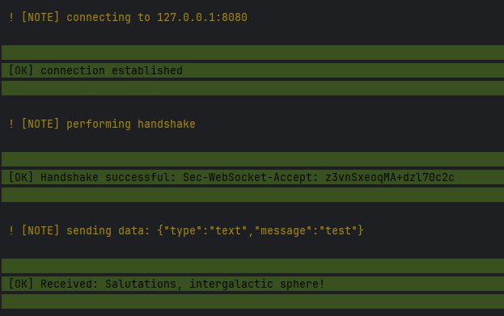

# Symfony Websocket Server Bundle
RFC 6455-compliant Websocket Server Bundle for Symfony 7

## installation

checkout library
`composer req snoke/symfony-websocket`

modify `config/packages/snoke_websocket.yaml`:
````yml
snoke_websocket:
    context:
        tls:
            local_cert: 'path/to/server.pem'
            local_pk: 'path/to/private.key'
            allow_self_signed: true
            verify_peer: false
````

if you do not want to use TLS:
````yml
snoke_websocket:
    context: []
````
note that websockets without TLS only work on localhost (tho you can still use Stunnel to wrap them into a TLS Connection)

## getting started
### Starting the WebSocket Server

Use the Symfony console command to start the WebSocket server

`php bin/console websocket:start`

You can optionally specify the IP address and port:

`php bin/console websocket:start --ip=127.0.0.1 --port=9000`



### testing the server

you can connect and send a message to your websocket server with following command:

`php bin/console websocket:test`



### Registering Event Listeners

to react to WebSocket events, create your own listeners.

```php
use Snoke\Websocket\Event\MessageReceived;
use Symfony\Component\EventDispatcher\Attribute\AsEventListener;

#[AsEventListener(event: MessageReceived::class, method: 'onRequestReceived')]
final class MessageListener
{
    public function onRequestReceived(MessageReceived $event): void
    {
        $connection = $event->getConnection();
        $connection->send("Salutations, intergalactic sphere!");
    }
}
```
test again with `php bin/console websocket:test`




### Mapping Users
the ConnectionWrapper contains getter and setter to match a connection with a Symfony UserInterface
```php
namespace App\EventListener;

use App\Security\Authenticator;
use Snoke\Websocket\Event\RequestReceived;
use Symfony\Component\Serializer\SerializerInterface;
use Symfony\Component\EventDispatcher\Attribute\AsEventListener;

#[AsEventListener(event: RequestReceived::class, method: 'onRequestReceived')]
final class AuthListener
{
    public function __construct(
        private readonly Authenticator,
        private readonly SerializerInterface
    ) {}
    
    public function onRequestReceived(RequestReceived $event): void
    {
        $request = $event->getRequest();
        $connection = $event->getConnection();
        if ($request['type'] === 'auth') {
            $payload = $request['payload'];
            $user = $this->authenticator->authenticate($payload['identifier'],$payload['password']);
            $connection->setUser($user);
            $connection->send($serializer->serialize($user, 'json'));
        }
    }
}
```

### Broadcasting
you can access all connections in the Listeners through the event
```php
foreach($event->getConnections() as $connection) {
    $connection->send($message);
}
```
### Available Events
- ServerStarted: Triggered when the WebSocket server is started.
- ConnectionOpened: Triggered when a new WebSocket connection is established.
- ConnectionClosed: Triggered when a WebSocket connection is closed.
- Error: Triggered when an error occurs.
- MessageReceived: Triggered when a WebSocket message is received.
- TextFrame: Triggered after MessageReceived when a text message frame is received (WebSocketOpcode::TextFrame).
- BinaryFrame: Triggered after MessageReceived  when a binary message frame is received (WebSocketOpcode::BinaryFrame).
- ContinuationFrame: Triggered after MessageReceived d when a continuation frame is received for a fragmented message (WebSocketOpcode::ContinuationFrame).
- ConnectionCloseFrame: Triggered after MessageReceived when a connection close frame is received (WebSocketOpcode::ConnectionCloseFrame).
- PingFrame: Triggered after DataReceived  when a ping frame is received (WebSocketOpcode::PingFrame).
- PongFrame: Triggered after DataReceived  when a pong frame is received (WebSocketOpcode::PongFrame).

## Extended
### Message Fragmentation

#### The server handles fragmented messages using the following opcodes:

    TextFrame (0x1)
    BinaryFrame (0x2)
    ContinuationFrame (0x0)

#### When a message is fragmented:

    The first frame (Text or Binary Frame) starts with FIN set to 0.
    Subsequent frames (Continuation Frames) continue the message with FIN set to 0 until the last frame.
    The last frame of the message has FIN set to 1, indicating the end of the fragmented message.

Ensure your application handles fragmented messages correctly based on RFC 6455 specifications.
